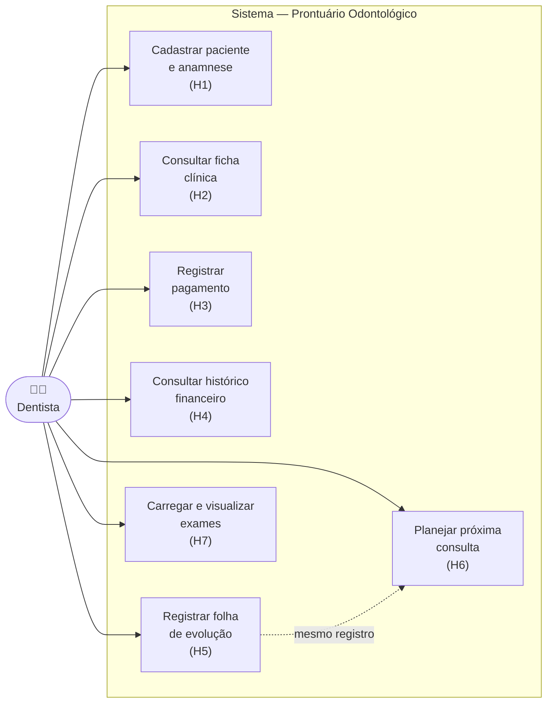
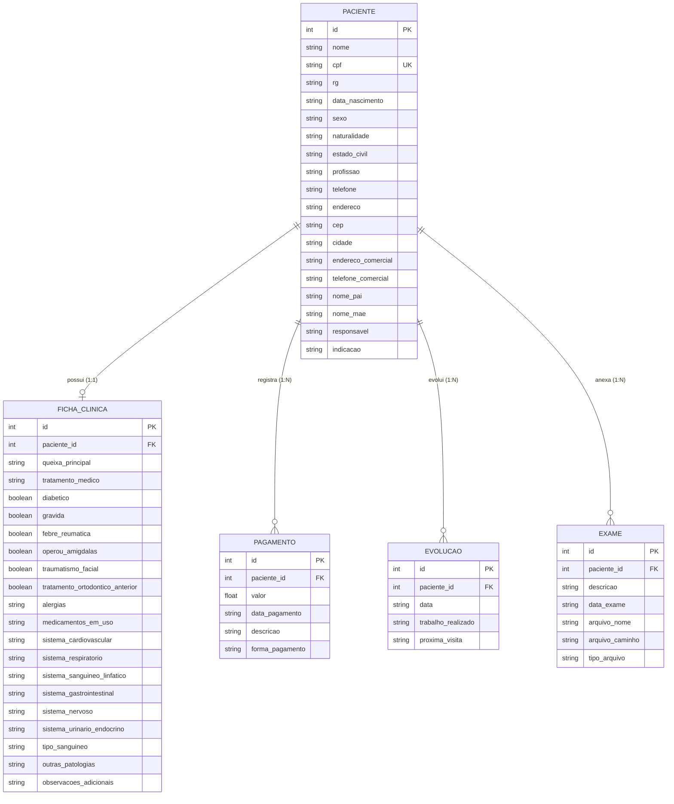
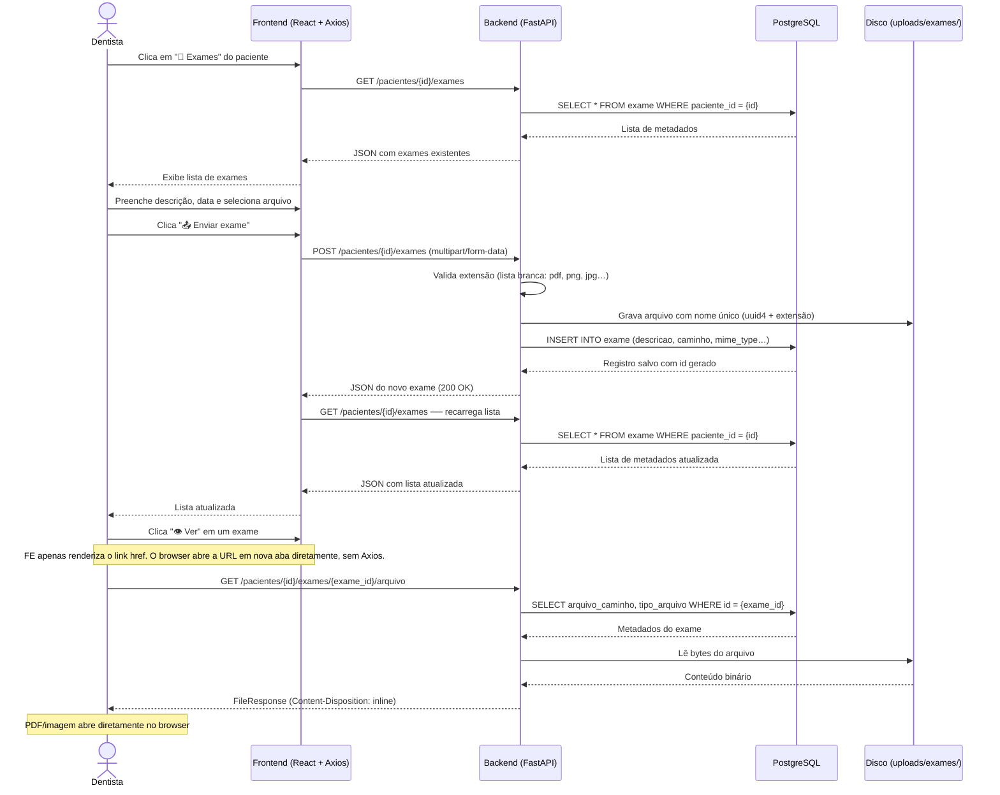

# TP1-Engenharia-de-Software

## Prontuário odontológico

### Membros do projeto:

- Bernardo Borges Machado - Full Stack
- Leonardo Cesar Cota de Castro - Full Stack
- Luis Felipe Pimenta Marcos - Full Stack

### Objetivo do sistema:
O sistema consiste em um prontuário odontológico digital desenvolvido para otimizar a gestão de consultórios. Ele visa substituir registros físicos por uma plataforma digital que centraliza dados pessoais, anamneses e o histórico clínico dos pacientes. Além disso, o software gerencia o fluxo financeiro de pagamentos e o planejamento de tratamentos, permitindo o registro de procedimentos realizados e a organização das próximas consultas, garantindo maior agilidade e segurança na administração dos atendimentos.

### Tecnologias a serem utilizadas:
Frontend: React + TypeScript + Vite + Axios.

Backend: Python com FastAPI.

Banco de Dados: PostgreSQL.

Agentes de IA: Claude Code/Gemini.

### Histórias de usuário:
1. Cadastro e Anamnese: Como dentista, quero cadastrar os dados pessoais e a anamnese do paciente para manter um histórico clínico detalhado e acessível.

2. Consulta de Ficha: Como dentista, quero visualizar a ficha clínica completa do paciente para revisar alergias e condições de saúde antes de iniciar um procedimento.

3. Registro de Pagamento: Como dentista, quero registrar os valores recebidos de cada paciente para manter o controle financeiro do consultório atualizado.

4. Histórico Financeiro: Como dentista, quero consultar a ficha de pagamentos de um paciente para identificar débitos pendentes ou saldos em aberto.

5. Folha de Evolução: Como dentista, quero registrar o trabalho realizado em cada consulta para documentar a evolução do tratamento clínico.

6. Planejamento de Tratamento: Como dentista, quero listar os trabalhos a serem feitos na próxima consulta para organizar os materiais e o tempo necessário para o atendimento.

7. Registro de Exames: Como dentista, quero carregar e armazenar exames feitos pelo paciente para centralizar o registro das suas informações clínicas.

---

## Documentação UML

### Diagrama 1 — Casos de Uso

Representa o escopo funcional do sistema do ponto de vista do dentista (único ator). Cada caso de uso corresponde a uma história de usuário implementada.

---

### Diagrama 2 — Entidade-Relacionamento (ER)

Representa as tabelas do banco de dados PostgreSQL, seus principais atributos e os relacionamentos entre elas. `paciente` é a entidade central; todas as demais dependem dela via chave estrangeira `paciente_id`.

> **Notas de design:** a relação `PACIENTE ↔ FICHA_CLINICA` é 1:1 (garantida por `UNIQUE` em `paciente_id`), pois cada paciente tem exatamente uma anamnese. As demais entidades são 1:N, pois um paciente acumula múltiplos pagamentos, consultas e exames ao longo do tratamento. Não há `ON DELETE CASCADE` no banco; a exclusão em cascata é feita manualmente pelo backend antes de remover o paciente.

---

### Diagrama 3 — Sequência: Registro de Exame

Ilustra o fluxo completo da **História 7** — do clique do dentista até a exibição do arquivo no browser — e evidencia a separação de responsabilidades entre as camadas da aplicação.

